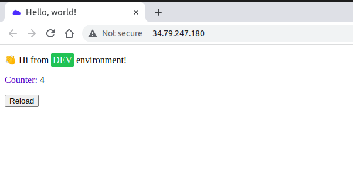
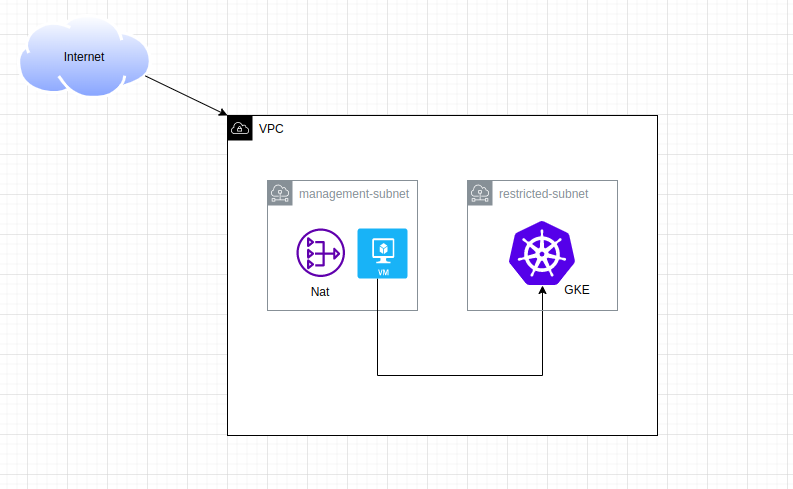

# Demo


## Brief
Provision GCP infrstructure using Terraform , Docker, Kubernetes.

## Cloning this project
```bash
$ git clone https://github.com/matriix00/GCP-Terraform-Task.git
```

##  Provision  GCP with Terraform


Install [Terraform](https://developer.hashicorp.com/terraform/tutorials/aws-get-started/install-cli) to build infrastructure as commands below .

```bash
$ terraform init 
$ terraform apply -auto-apprvove
```

## Build image inside demo-project
> **_Hint:_**  ```HOSTNAME ```/ ``` PROJECT-ID ```/ ```TARGET-IMAGE ```

> **_Sub:_** ```gcr.io ```/ ``` GCP project ```/ ```image name ```

#### *  Make sure that you have :
1- [Enabled container registry ](https://cloud.google.com/container-registry/docs/enable-service) in your project .

2- [Installed and configured Docker ](https://cloud.google.com/container-registry/docs/advanced-authentication).

```bash
$ docker build /Devops-Code/ -t simple-image
$ docker tag simple-image gcr.io/omarmagdy/python-app
$ docker push gcr.io/omarmagdy/python-app
```
## Play with Kubernetes 
- connect to management-vm
```gcloud compute ssh management-vm ```

 - copy files into vm from bucket```gsutil cp -r k8s/ gs://c40ae32d2f365eb6-bucket-tfstate```
- apply kubectl config 
```sudo apt-get install google-cloud-sdk-gke-gcloud-auth-plugin```
```&&```
```gcloud container clusters get-credentials cluster-lab --region europe-west1```
```
$ kubectl apply -f config.yaml
$ kubectl apply -f redis.yaml
$ kubectl apply -f python-deployment.yaml
```
## Clean 
```bash
$ terraform destroy -auto-apprvove
```
## Contributing
Pull requests are welcome. For major changes, please open an issue first to discuss what you would like to change.

Please make sure to update tests as appropriate.
